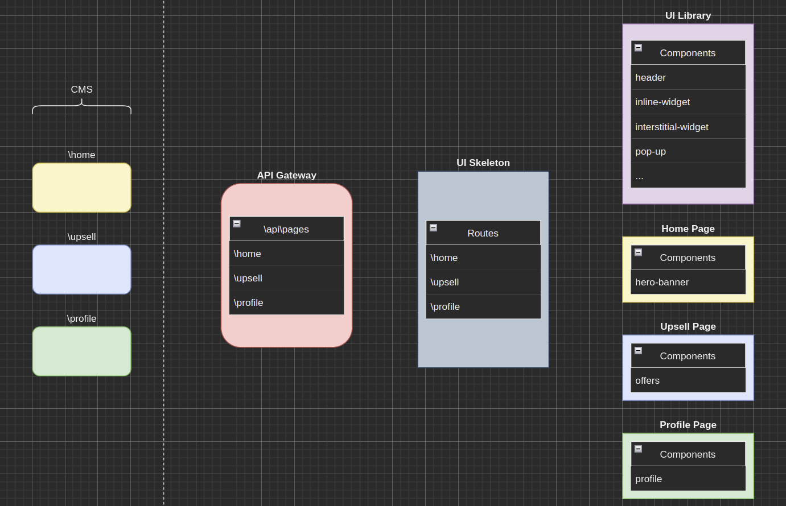

# MyBooks Mono Repo

MyBooks Mono Repo Architecture diagram



## How to init the repos

```sh
sh ./scripts/npm-install.sh
```

or

```
npm run setup
```

## Create new project

```
npx create-mf-app
```

## Notes

https://webpack.js.org/api/module-methods/#dynamic-expressions-in-import
https://loadable-components.com/docs/dynamic-import/
